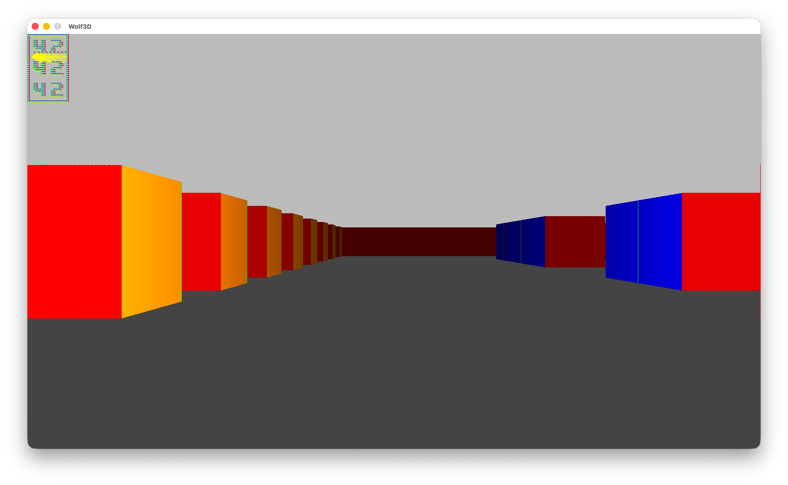

# Wolf3D

Wolf3D is a small C raycasting project inspired by early first-person games such
as Wolfenstein 3D. It reads a grid-based map file, renders a pseudo-3D view with
MiniLibX, and lets the player move through the level in real time.

The project was built in the 42 school style and includes local copies of:

- `libft`: custom C utility library.
- `mlx`: MiniLibX graphics library.



## Features

- Real-time raycasting renderer.
- Grid-based map loader.
- Multiple maps/levels in one map file.
- Wall collision.
- Optional end tile value in the map header.
- Keyboard movement and rotation.
- Mouse editing on the minimap: left-click toggles floor/wall cells inside the
  map borders.

## Repository Layout

```text
.
|-- Makefile              Build rules for wolf3d
|-- includes/wolf3d.h     Main project header
|-- libft/                Local libft dependency
|-- mlx/                  Local MiniLibX dependency
|-- ressources/           Graphic resources
|-- src/                  Wolf3D source files
|-- zmap                  Example map file
`-- wolf3d                Built executable, generated by make
```

## Requirements

### macOS

- `gcc` or Apple Clang command line tools.
- macOS frameworks used by MiniLibX:
  - `OpenGL`
  - `AppKit`

The bundled `mlx/` directory is compiled by the top-level `Makefile`.

### Linux

The top-level `Makefile` contains Linux linker flags for X11:

- `libXext`
- `libX11`
- MiniLibX

If the bundled `mlx/` directory does not match your Linux environment, replace
or point `MLX_DIR` to a Linux-compatible MiniLibX directory.

## Compile

Build the project:

```sh
make
```

This builds:

- `libft/libft.a`
- MiniLibX from `mlx/`
- object files in `.obj/`
- the final executable: `wolf3d`

Clean object files:

```sh
make clean
```

Remove object files and the executable:

```sh
make fclean
```

Rebuild from scratch:

```sh
make re
```

Build a debug binary with `-g`:

```sh
make gdb
```

Use a different MiniLibX directory:

```sh
make MLX_DIR=/path/to/minilibx
```

## Run

Run the program with a map file:

```sh
./wolf3d zmap
```

If no map is provided, the program prints:

```text
usage : ./wolf3d map
```

## Controls

| Action | Keys |
| --- | --- |
| Move forward | `W`, `Up Arrow` |
| Move backward | `S`, `Down Arrow` |
| Turn left | `A`, `Left Arrow` |
| Turn right | `D`, `Right Arrow` |
| Run modifier | `Shift` |
| Toggle saved display flag | `H` |
| Quit | `Esc`, `Q` |
| Toggle wall/floor on minimap | Left mouse click |

Notes:

- The window size is defined in `includes/wolf3d.h` with `WIDTH` and `HEIGHT`.
- Movement constants such as `RA`, `VISION`, and `RUN` are also defined in
  `includes/wolf3d.h`.
- The current `RUN` flag is captured from the keyboard, but movement speed is
  fixed in `src/eb_move.c`.

## Map Format

Maps are plain text files. A file may contain one or more maps appended one
after another.

Each map starts with a header line:

```text
width height name wall floor start [end]
```

Fields:

| Field | Description |
| --- | --- |
| `width` | Number of cells per row. |
| `height` | Number of rows in the map. |
| `name` | Map name. |
| `wall` | Integer value treated as a wall. |
| `floor` | Integer value treated as empty floor. |
| `start` | Integer value used to place the player. |
| `end` | Optional integer value treated as an end tile. Defaults to `-1`. |

After the header, exactly `height` rows follow. Each row must contain `width`
integer cell values separated by spaces.

Example:

```text
5 5 demo 1 0 2 3
1 1 1 1 1
1 2 0 3 1
1 0 0 0 1
1 0 0 0 1
1 1 1 1 1
```

Cell values are interpreted according to the header. With the example above:

- `1` is a wall.
- `0` is floor.
- `2` is the start position.
- `3` is the end position.

The provided `zmap` file contains two maps:

- `test`
- `test2`

Both maps use:

- width: `21`
- height: `35`
- wall value: `10`
- floor value: `0`
- start value: `2`

## Examples

Build and run the bundled map:

```sh
make
./wolf3d zmap
```

Run with a custom map:

```sh
./wolf3d maps/my_map
```

If you create a custom map, keep the outer border closed with wall cells. The
raycaster and mouse editor assume map coordinates stay inside valid bounds.

## Tests

There is no dedicated automated test suite in this repository.

Useful manual checks:

```sh
make
./wolf3d
./wolf3d zmap
make re
make fclean
```

Expected results:

- `make` finishes and creates `./wolf3d`.
- `./wolf3d` prints the usage message.
- `./wolf3d zmap` opens a MiniLibX window.
- `make re` rebuilds the project.
- `make fclean` removes `.obj/` and `wolf3d`.

## Troubleshooting

### MiniLibX does not compile

Check that `mlx/` matches your operating system. On Linux, you may need a
Linux-compatible MiniLibX and the X11 development libraries.

You can point the build to another MiniLibX directory:

```sh
make MLX_DIR=/path/to/minilibx
```

### Linker errors on macOS

Make sure the command line tools are installed:

```sh
xcode-select --install
```

The macOS build links with:

```text
-lmlx -framework OpenGL -framework AppKit
```

### Invalid or crashing map

Verify that:

- The header has 6 or 7 fields.
- Each map has exactly `height` rows.
- Each row has exactly `width` integers.
- The map contains the configured `start` value.
- The border is closed with wall cells.

## Implementation Notes

- Entry point: `src/main.c`
- Map loading: `src/eb_getdata.c`
- MiniLibX setup and input hooks: `src/eb_mlx.c`
- Movement and collision: `src/eb_move.c`
- Drawing/minimap: `src/eb_draw.c`, `src/eb_trace.c`
- Raycasting: `src/eb_raytracing.c`
- Color helpers: `src/eb_color.c`

The program currently prints parsed map data to stdout before opening the
window. Those debug messages come from `src/main.c` and `src/eb_getdata.c`.
